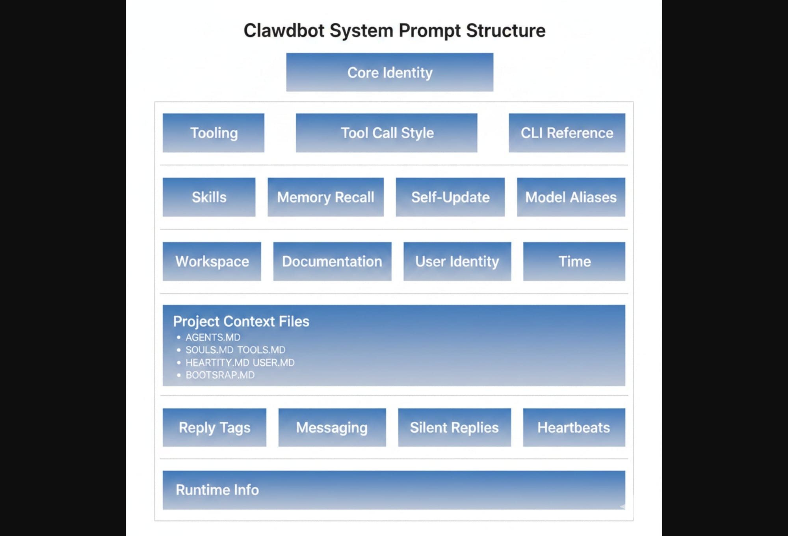
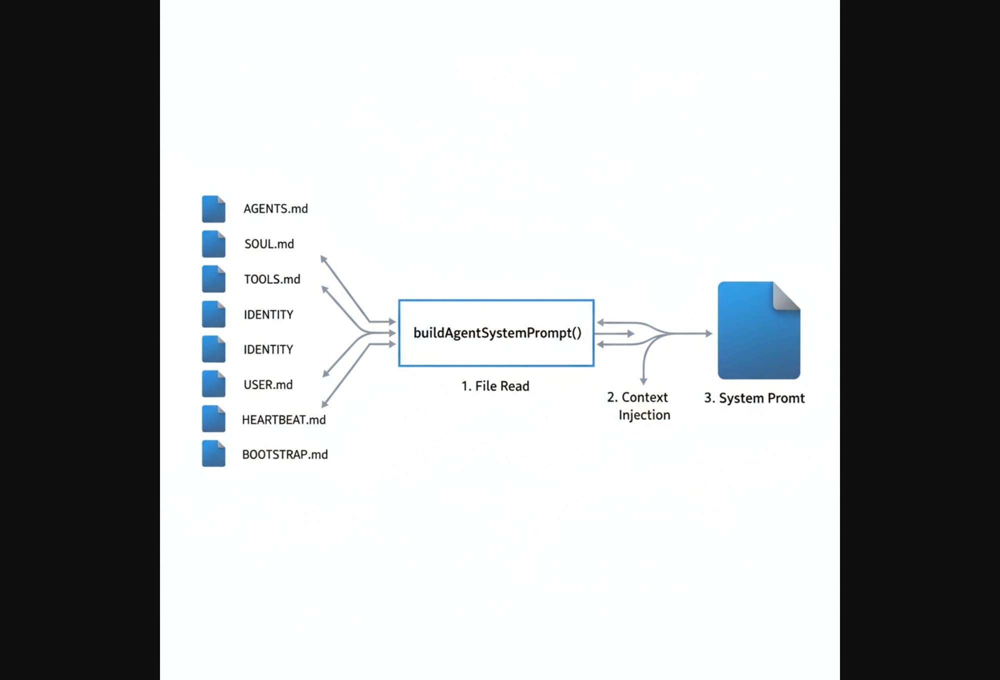
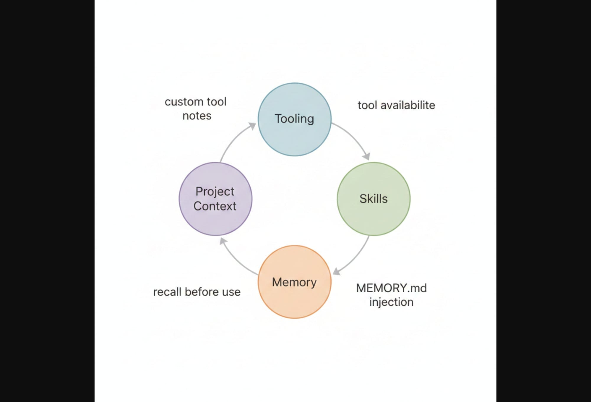
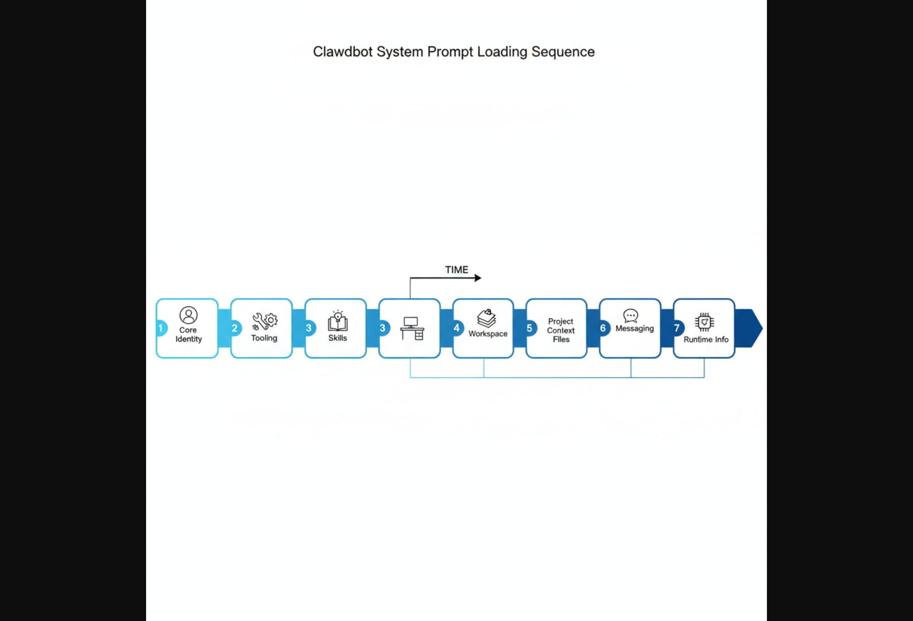

# Clawdbot System Prompt 結構說明

> **版本：** 1.1.0  
> **更新時間：** 2026-02-08  
> **源碼位置：** `clawdbot/dist/agents/system-prompt.js`

## 📋 概述

Clawdbot 的 System Prompt 由 `buildAgentSystemPrompt()` 函數動態生成，根據運行時配置組裝不同區塊。本文件說明每個區塊的用途和結構。

---

## 🖼️ 圖解總覽

### 圖 1：整體架構圖
展示 System Prompt 的 7 層結構：



### 圖 2：資料流向圖
展示 7 個檔案如何通過 `buildAgentSystemPrompt()` 組裝成 System Prompt：



### 圖 3：區塊關係圖
展示 Tooling、Skills、Memory、Project Context 四個主要區塊的互動關係：



### 圖 4：載入順序圖
展示 7 個階段的時間線（Core Identity → Tooling → Skills → Workspace → Project Context → Messaging → Runtime）：



---

## 🏗️ 整體架構

System Prompt 由以下主要區塊組成：

```
┌─────────────────────────────────────────────┐
│  Core Identity（核心身份）                    │
├─────────────────────────────────────────────┤
│  ## Tooling（工具配置）                       │
│  ## Tool Call Style（工具調用風格）            │
│  ## Clawdbot CLI Quick Reference            │
├─────────────────────────────────────────────┤
│  ## Skills（技能系統）                        │
│  ## Memory Recall（記憶召回）                 │
│  ## Clawdbot Self-Update（自我更新）          │
│  ## Model Aliases（模型別名）                 │
├─────────────────────────────────────────────┤
│  ## Workspace（工作區）                       │
│  ## Documentation（文件）                     │
│  ## Sandbox（沙箱 - 可選）                    │
│  ## User Identity（用戶身份 - 可選）           │
│  ## Current Date & Time（時間）               │
├─────────────────────────────────────────────┤
│  ## Workspace Files (injected)              │
│  ## Reply Tags（回覆標籤）                    │
│  ## Messaging（訊息系統）                     │
│  ## Voice (TTS)（語音 - 可選）                │
├─────────────────────────────────────────────┤
│  ## Subagent/Group Chat Context（額外上下文） │
│  ## Reactions（反應 - 可選）                  │
│  ## Reasoning Format（推理格式 - 可選）        │
├─────────────────────────────────────────────┤
│  # Project Context（專案上下文）              │
│    - AGENTS.md                              │
│    - SOUL.md                                │
│    - TOOLS.md                               │
│    - IDENTITY.md                            │
│    - USER.md                                │
│    - HEARTBEAT.md                           │
│    - BOOTSTRAP.md                           │
├─────────────────────────────────────────────┤
│  ## Silent Replies（靜默回覆）                │
│  ## Heartbeats（心跳機制）                    │
│  ## Runtime（運行時資訊）                     │
└─────────────────────────────────────────────┘
```

---

## 🔧 詳細區塊說明

### 1. Core Identity（核心身份）

最基礎的身份聲明，永遠是 prompt 的開頭：

```javascript
"You are a personal assistant running inside Clawdbot."
```

> 📝 **用途：** 建立 AI 的基本角色定位

---

### 2. Tooling（工具配置）

列出所有可用的工具及其簡要說明：

```javascript
const coreToolSummaries = {
    read: "Read file contents",
    write: "Create or overwrite files",
    edit: "Make precise edits to files",
    apply_patch: "Apply multi-file patches",
    grep: "Search file contents for patterns",
    find: "Find files by glob pattern",
    ls: "List directory contents",
    exec: "Run shell commands (pty available for TTY-required CLIs)",
    process: "Manage background exec sessions",
    web_search: "Search the web (Brave API)",
    web_fetch: "Fetch and extract readable content from a URL",
    browser: "Control web browser",
    canvas: "Present/eval/snapshot the Canvas",
    nodes: "List/describe/notify/camera/screen on paired nodes",
    cron: "Manage cron jobs and wake events...",
    message: "Send messages and channel actions",
    gateway: "Restart, apply config, or run updates...",
    agents_list: "List agent ids allowed for sessions_spawn",
    sessions_list: "List other sessions...",
    sessions_history: "Fetch history for another session/sub-agent",
    sessions_send: "Send a message to another session/sub-agent",
    sessions_spawn: "Spawn a sub-agent session",
    session_status: "Show a /status-equivalent status card...",
    image: "Analyze an image with the configured image model",
};
```

**生成的 Prompt 格式：**
```
## Tooling
Tool availability (filtered by policy):
Tool names are case-sensitive. Call tools exactly as listed.
- read: Read file contents
- write: Create or overwrite files
- edit: Make precise edits to files
...
```

> 📝 **用途：** 告知 AI 有哪些工具可用，避免調用不存在的工具

---

### 3. Tool Call Style（工具調用風格）

指導 AI 何時應該解釋、何時應該直接執行：

```
## Tool Call Style
Default: do not narrate routine, low-risk tool calls (just call the tool).
Narrate only when it helps: multi-step work, complex/challenging problems, 
sensitive actions (e.g., deletions), or when the user explicitly asks.
Keep narration brief and value-dense; avoid repeating obvious steps.
Use plain human language for narration unless in a technical context.
```

> 📝 **用途：** 減少不必要的解釋，提高回應效率

---

### 4. CLI Quick Reference（CLI 快速參考）

提供 Clawdbot CLI 的基本指令：

```
## Clawdbot CLI Quick Reference
Clawdbot is controlled via subcommands. Do not invent commands.
To manage the Gateway daemon service (start/stop/restart):
- clawdbot gateway status
- clawdbot gateway start
- clawdbot gateway stop
- clawdbot gateway restart
If unsure, ask the user to run `clawdbot help`...
```

> 📝 **用途：** 確保 AI 使用正確的 CLI 指令

---

### 5. Skills（技能系統）

由 `buildSkillsSection()` 函數生成：

```javascript
function buildSkillsSection(params) {
    if (params.isMinimal) return [];
    const trimmed = params.skillsPrompt?.trim();
    if (!trimmed) return [];
    return [
        "## Skills (mandatory)",
        "Before replying: scan <available_skills> <description> entries.",
        `- If exactly one skill clearly applies: read its SKILL.md at <location>...`,
        "- If multiple could apply: choose the most specific one...",
        "- If none clearly apply: do not read any SKILL.md.",
        "Constraints: never read more than one skill up front...",
        trimmed,
    ];
}
```

> 📝 **用途：** 指導 AI 如何選擇和使用技能模組

---

### 6. Memory Recall（記憶召回）

由 `buildMemorySection()` 函數生成，僅在有記憶工具時啟用：

```javascript
function buildMemorySection(params) {
    if (params.isMinimal) return [];
    if (!params.availableTools.has("memory_search") && 
        !params.availableTools.has("memory_get")) {
        return [];
    }
    return [
        "## Memory Recall",
        "Before answering anything about prior work, decisions, dates, people, " +
        "preferences, or todos: run memory_search on MEMORY.md + memory/*.md; " +
        "then use memory_get to pull only the needed lines...",
    ];
}
```

> 📝 **用途：** 指導 AI 在回答問題前先搜尋記憶文件

---

### 7. Self-Update（自我更新）

僅在 `gateway` 工具可用且非 minimal 模式時啟用：

```javascript
hasGateway && !isMinimal
    ? [
        "Get Updates (self-update) is ONLY allowed when the user explicitly asks...",
        "Do not run config.apply or update.run unless the user explicitly requests...",
        "Actions: config.get, config.schema, config.apply..., update.run...",
        "After restart, Clawdbot pings the last active session automatically.",
    ].join("\n")
    : ""
```

> 📝 **用途：** 防止 AI 擅自執行更新，需用戶明確要求

---

### 8. Model Aliases（模型別名）

提供模型名稱的簡寫對應：

```
## Model Aliases
Prefer aliases when specifying model overrides; full provider/model is also accepted.
sonnet → anthropic/claude-sonnet-4
opus → anthropic/claude-opus-4
...
```

> 📝 **用途：** 方便用戶和 AI 使用簡短的模型名稱

---

### 9. Workspace（工作區）

指定 AI 的工作目錄：

```javascript
"## Workspace",
`Your working directory is: ${params.workspaceDir}`,
"Treat this directory as the single global workspace for file operations..."
```

> 📝 **用途：** 設定文件操作的根目錄

---

### 10. Documentation（文件）

由 `buildDocsSection()` 函數生成：

```javascript
function buildDocsSection(params) {
    const docsPath = params.docsPath?.trim();
    if (!docsPath || params.isMinimal) return [];
    return [
        "## Documentation",
        `Clawdbot docs: ${docsPath}`,
        "Mirror: https://docs.clawd.bot",
        "Source: https://github.com/clawdbot/clawdbot",
        "Community: https://discord.com/invite/clawd",
        "Find new skills: https://clawdhub.com",
        "For Clawdbot behavior, commands, config, or architecture: consult local docs first.",
        "When diagnosing issues, run `clawdbot status` yourself when possible...",
    ];
}
```

> 📝 **用途：** 提供文件資源連結

---

### 11. Time（時間）

由 `buildTimeSection()` 函數生成：

```javascript
function buildTimeSection(params) {
    if (!params.userTimezone) return [];
    return ["## Current Date & Time", `Time zone: ${params.userTimezone}`, ""];
}
```

> 📝 **用途：** 告知 AI 用戶的時區

---

### 12. Reply Tags（回覆標籤）

由 `buildReplyTagsSection()` 函數生成：

```javascript
function buildReplyTagsSection(isMinimal) {
    if (isMinimal) return [];
    return [
        "## Reply Tags",
        "To request a native reply/quote on supported surfaces, include one tag...",
        "- [[reply_to_current]] replies to the triggering message.",
        "- [[reply_to:<id>]] replies to a specific message id...",
        "Whitespace inside the tag is allowed...",
        "Tags are stripped before sending...",
    ];
}
```

> 📝 **用途：** 啟用訊息回覆功能

---

### 13. Messaging（訊息系統）

由 `buildMessagingSection()` 函數生成，是較複雜的區塊：

```javascript
function buildMessagingSection(params) {
    if (params.isMinimal) return [];
    return [
        "## Messaging",
        "- Reply in current session → automatically routes to the source channel...",
        "- Cross-session messaging → use sessions_send(sessionKey, message)",
        "- Never use exec/curl for provider messaging; Clawdbot handles all routing...",
        // 當 message 工具可用時，添加更多說明
        params.availableTools.has("message")
            ? [
                "### message tool",
                "- Use `message` for proactive sends + channel actions...",
                "- For `action=send`, include `to` and `message`.",
                `- If multiple channels are configured, pass \`channel\`...`,
                // inline buttons 相關說明
                // ...
            ]
            : "",
    ];
}
```

> 📝 **用途：** 指導 AI 如何發送訊息到不同頻道

---

### 14. Project Context（專案上下文）

注入用戶定義的配置文件：

```javascript
const contextFiles = params.contextFiles ?? [];
if (contextFiles.length > 0) {
    lines.push("# Project Context", "", "The following project context files have been loaded:");
    if (hasSoulFile) {
        lines.push("If SOUL.md is present, embody its persona and tone...");
    }
    for (const file of contextFiles) {
        lines.push(`## ${file.path}`, "", file.content, "");
    }
}
```

**支援的文件：**
| 文件 | 用途 |
|------|------|
| `AGENTS.md` | 工作區規範、行為準則 |
| `SOUL.md` | AI 人格、語氣、風格 |
| `TOOLS.md` | 本地工具配置筆記 |
| `IDENTITY.md` | 額外身份設定 |
| `USER.md` | 用戶偏好和資訊 |
| `HEARTBEAT.md` | 心跳任務清單 |
| `BOOTSTRAP.md` | 首次啟動指引 |

> 📝 **用途：** 讓用戶自訂 AI 的行為和人格

---

### 15. Silent Replies（靜默回覆）

指導 AI 何時應該保持沉默：

```javascript
if (!isMinimal) {
    lines.push(
        "## Silent Replies",
        `When you have nothing to say, respond with ONLY: ${SILENT_REPLY_TOKEN}`,
        "",
        "⚠️ Rules:",
        "- It must be your ENTIRE message — nothing else",
        `- Never append it to an actual response...`,
        "- Never wrap it in markdown or code blocks",
        "",
        `❌ Wrong: "Here's help... ${SILENT_REPLY_TOKEN}"`,
        `❌ Wrong: "${SILENT_REPLY_TOKEN}"`,
        `✅ Right: ${SILENT_REPLY_TOKEN}`,
    );
}
```

> 📝 **用途：** 在群聊中避免不必要的回覆

---

### 16. Heartbeats（心跳機制）

心跳輪詢的處理方式：

```javascript
if (!isMinimal) {
    lines.push(
        "## Heartbeats",
        heartbeatPromptLine,
        "If you receive a heartbeat poll..., and there is nothing that needs attention, " +
        "reply exactly:",
        "HEARTBEAT_OK",
        'Clawdbot treats a leading/trailing "HEARTBEAT_OK" as a heartbeat ack...',
        'If something needs attention, do NOT include "HEARTBEAT_OK"; reply with the alert text...',
    );
}
```

> 📝 **用途：** 實現定期檢查機制

---

### 17. Runtime（運行時資訊）

由 `buildRuntimeLine()` 函數生成，提供當前運行環境資訊：

```javascript
export function buildRuntimeLine(runtimeInfo, runtimeChannel, runtimeCapabilities = [], defaultThinkLevel) {
    return `Runtime: ${[
        runtimeInfo?.agentId ? `agent=${runtimeInfo.agentId}` : "",
        runtimeInfo?.host ? `host=${runtimeInfo.host}` : "",
        runtimeInfo?.repoRoot ? `repo=${runtimeInfo.repoRoot}` : "",
        runtimeInfo?.os ? `os=${runtimeInfo.os}${runtimeInfo?.arch ? ` (${runtimeInfo.arch})` : ""}` : "",
        runtimeInfo?.node ? `node=${runtimeInfo.node}` : "",
        runtimeInfo?.model ? `model=${runtimeInfo.model}` : "",
        runtimeInfo?.defaultModel ? `default_model=${runtimeInfo.defaultModel}` : "",
        runtimeChannel ? `channel=${runtimeChannel}` : "",
        runtimeChannel ? `capabilities=${runtimeCapabilities.length > 0 ? runtimeCapabilities.join(",") : "none"}` : "",
        `thinking=${defaultThinkLevel ?? "off"}`,
    ].filter(Boolean).join(" | ")}`;
}
```

**範例輸出：**
```
Runtime: agent=main | host=MyPC | repo=/home/user/clawd | os=Linux 6.8.0 (x64) | 
node=v22.17.0 | model=anthropic/claude-opus-4 | channel=discord | capabilities=none | thinking=low
```

> 📝 **用途：** 提供環境資訊，幫助 AI 適應不同配置

---

## 🔀 Prompt Mode（模式切換）

System Prompt 支援三種模式：

| 模式 | 說明 | 用途 |
|------|------|------|
| `full` | 完整版本，包含所有區塊 | 主 session |
| `minimal` | 精簡版本，省略部分區塊 | Sub-agent |
| `none` | 只有基本身份聲明 | 特殊場景 |

```javascript
const promptMode = params.promptMode ?? "full";
const isMinimal = promptMode === "minimal" || promptMode === "none";

// For "none" mode, return just the basic identity line
if (promptMode === "none") {
    return "You are a personal assistant running inside Clawdbot.";
}
```

**Minimal 模式會省略：**
- Skills
- Memory Recall
- Self-Update
- Model Aliases
- Documentation
- Reply Tags
- Messaging 詳細說明
- Voice (TTS)
- Silent Replies
- Heartbeats

---

## 📊 完整函數簽名

```javascript
export function buildAgentSystemPrompt(params: {
    toolNames?: string[];
    toolSummaries?: Record<string, string>;
    skillsPrompt?: string;
    extraSystemPrompt?: string;
    ownerNumbers?: string[];
    reasoningTagHint?: boolean;
    reasoningLevel?: string;
    userTimezone?: string;
    heartbeatPrompt?: string;
    workspaceDir: string;
    workspaceNotes?: string[];
    docsPath?: string;
    ttsHint?: string;
    runtimeInfo?: RuntimeInfo;
    contextFiles?: Array<{ path: string; content: string }>;
    modelAliasLines?: string[];
    promptMode?: "full" | "minimal" | "none";
    sandboxInfo?: SandboxInfo;
    messageToolHints?: string[];
    reactionGuidance?: { level: string; channel: string };
    defaultThinkLevel?: string;
}): string
```

---

## 🔗 相關資源

- **Clawdbot 文件：** [docs.clawd.bot](https://docs.clawd.bot)
- **GitHub：** [github.com/clawdbot/clawdbot](https://github.com/clawdbot/clawdbot)
- **Discord 社群：** [discord.com/invite/clawd](https://discord.com/invite/clawd)
- **技能市集：** [clawdhub.com](https://clawdhub.com)

---

> **版本：** 1.1.0 | **更新時間：** 2026-02-08
